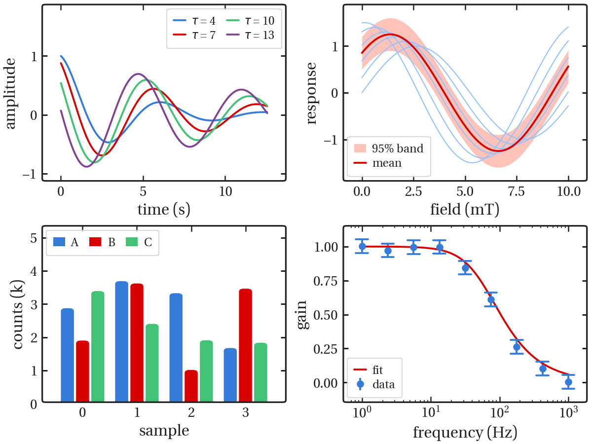
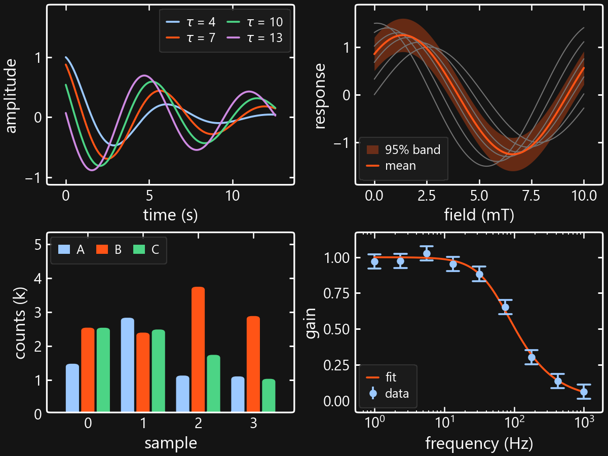
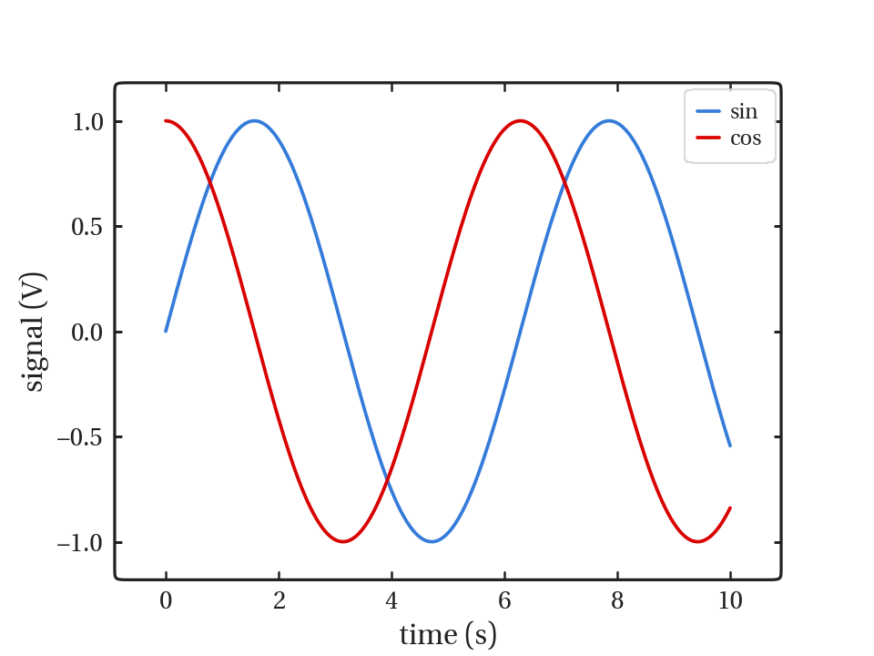
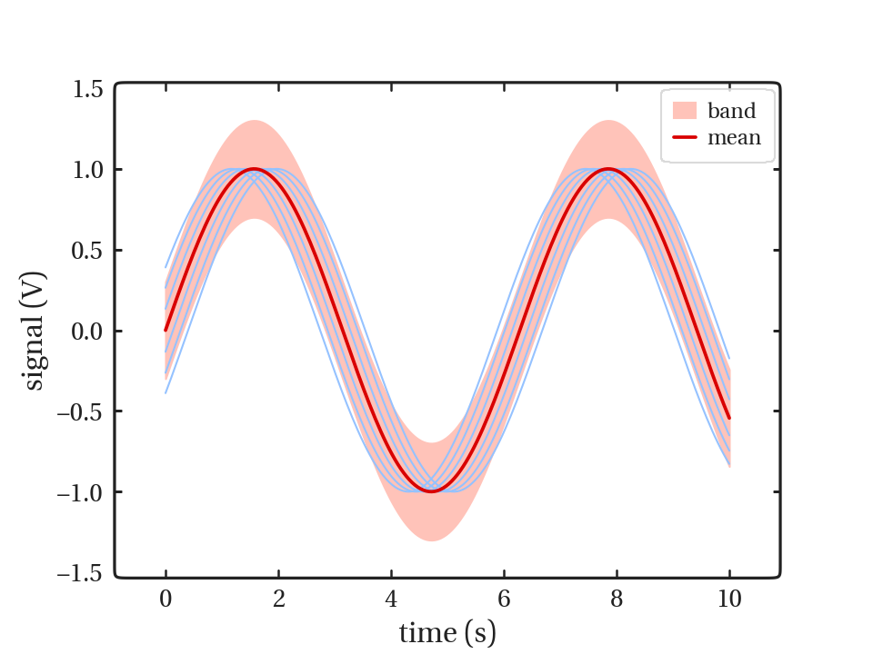
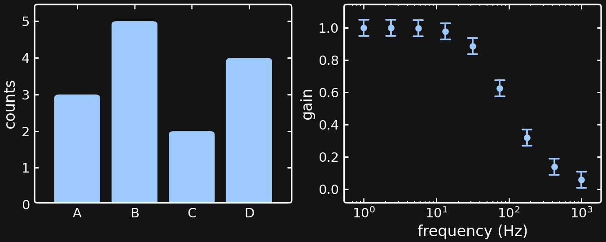

# hvb

hvb is a matplotlib style suited to my tastes. It consists of a style file, `hvb.mplstyle`, and helper
functions that replace the square axes frame with a superellipse, round the
corners of bars, histograms, box plots, violin plots, and error bars, and provide a set of
categorical color palettes. Basically, make soft, easy on the eyes plots, that are
still proessional looking.

<p>
  
  
</p>

The same four panels drawn with `hvb.use(scale=0.6)` (left) and `hvb.use(scale=0.6, dark=True)`
(right). They show a line plot with a legend, a primary line over `muted` context lines with a
`fill` confidence band, grouped bars, and error bars with a fit on a logarithmic axis.

## Installation

With pip:

```
pip install git+https://github.com/AlexanderBeach/hvb
```

With uv, either into the active environment or as a dependency of a uv project:

```
uv pip install git+https://github.com/AlexanderBeach/hvb
uv add git+https://github.com/AlexanderBeach/hvb
```

## Usage

```python
import numpy as np
import matplotlib.pyplot as plt
import hvb

hvb.use(scale=0.6)

x = np.linspace(0, 10, 200)
fig, ax = plt.subplots()
ax.plot(x, np.sin(x), label="sin")
ax.plot(x, np.cos(x), label="cos")
ax.set_xlabel("time (s)")
ax.set_ylabel("signal (V)")
ax.legend()
fig.savefig("figure.pdf")
```



`hvb.use()` applies the style globally. The squircle frame, the legend frame, and the tick
placement are applied when a figure is saved with `fig.savefig` or shown with `plt.show`, not
when it is drawn, so a figure rendered with `fig.canvas.draw()` alone will still have the
default matplotlib frame.

The arguments to `hvb.use()` are:

- `scale`: multiplies the frame, tick, grid, and data line widths, for figures smaller than
  the default size. Font sizes are left unchanged unless `text` is also set.
- `text`: `True` scales the font sizes by `scale` as well. A number scales the font sizes by
  that factor instead.
- `dark`: `True` switches to a `#141414` background with white text and frame, and the `dark`
  palette. A color string sets a different background color.
- `palette`: the name of the palette used for the color cycle (see below).
- `font`: the text font, either the name of an installed font or the path to a font file.
  Math keeps the default math font.
- `linewidth`: the data line width in points, overriding the width set by `scale`.
- `grid`: `False` by default. Calling `ax.grid(True)` on an individual axes still turns the
  grid on for that axes.
- `exponent`: the superellipse exponent n of the frame, 120 by default. A higher exponent gives
  smaller corners. The legend frame uses the same absolute corner radius as the axes frame,
  whatever the size of the legend.
- `flat_face_ticks`: `True` by default, which hides any tick that would land on a rounded
  corner of the frame rather than on a straight edge.
- `auto`: `False` sets the rcParams only, without the squircle frame, the legend styling, or
  the rounded bars and error bars.

Polar and 3D axes are left with the default matplotlib frame.

## Examples

A primary line drawn over `muted` context lines with a `fill` band, using the palettes directly:

```python
import numpy as np
import matplotlib.pyplot as plt
import hvb

hvb.use(scale=0.6)
muted = hvb.get_hvb_palette("muted")
fill = hvb.get_hvb_palette("fill")
default = hvb.get_hvb_palette("default")

x = np.linspace(0, 10, 200)
fig, ax = plt.subplots()
for phase in np.linspace(-0.4, 0.4, 7):
    ax.plot(x, np.sin(x + phase), color=muted[0], linewidth=1)
ax.fill_between(x, np.sin(x) - 0.3, np.sin(x) + 0.3, color=fill[1], label="band")
ax.plot(x, np.sin(x), color=default[1], label="mean")
ax.set_xlabel("time (s)")
ax.set_ylabel("signal (V)")
ax.legend()
fig.savefig("figure.pdf")
```



Bars and error bars on the dark background, with the text font changed:

```python
import numpy as np
import matplotlib.pyplot as plt
import hvb

hvb.use(scale=0.6, dark=True, font="DejaVu Sans")

fig, (ax1, ax2) = plt.subplots(1, 2, figsize=(9, 3.6), constrained_layout=True)
ax1.bar(["A", "B", "C", "D"], [3, 5, 2, 4])
ax1.set_ylabel("counts")

f = np.logspace(0, 3, 9)
ax2.set_xscale("log")
ax2.errorbar(f, 1 / np.sqrt(1 + (f / 60) ** 2), yerr=0.05, fmt="o")
ax2.set_xlabel("frequency (Hz)")
ax2.set_ylabel("gain")
fig.savefig("figure.pdf")
```



## Fonts

Text is set in hvb Serif and math (anything between `$` signs) in Fira Sans, a sans-serif font
designed by Erik Spiekermann and Carrois Apostrophe for Mozilla. Both are bundled in `hvb/fonts`
under the SIL Open Font License (`OFL-hvbSerif.txt` and `OFL-FiraSans.txt`), so figures look the
same on any computer without either font being installed. Characters that hvb Serif lacks, such as
≈ and ∞, are drawn from Fira Sans instead.

hvb Serif is converted from Erewhon, a serif font by Michael Sharpe.

## Palettes

| name | use |
|---|---|
| `default` | data lines on a white background |
| `muted` | context series that sit behind the primary lines |
| `fill` | fills and confidence bands, used opaque rather than with transparency |
| `dark` | data lines on a dark (`#141414`) background |
| `dark2`, `viridis` | samples of the matplotlib colormaps of the same name |

| # | hue | `default` | `muted` | `fill` | `dark` |
|---|---|---|---|---|---|
| 0 | blue |  `#357CDA` |  `#95C2FF` |  `#BBD8FF` |  `#9CC9FF` |
| 1 | red |  `#D90000` |  `#FFA091` |  `#FFC3B9` |  `#FF5416` |
| 2 | green |  `#42C275` |  `#A2DDB2` |  `#C0E9CB` |  `#4CD485` |
| 3 | purple |  `#814195` |  `#D2A2E1` |  `#E4C2EF` |  `#CF8AE3` |
| 4 | orange |  `#DD7B00` |  `#F6BB8D` |  `#FCD3B2` |  `#ED9E3E` |
| 5 | yellow |  `#EAE00A` |  `#E5E3A6` |  `#EDECC2` |  `#E3D03F` |
| 6 | pink |  `#F835A2` |  `#FFABCF` |  `#FFCADF` |  `#F670A4` |
| 7 | brown |  `#64341D` |  `#CC9F8B` |  `#E1C0B2` |  `#CB8668` |

The four categorical palettes use the same eight hues in the same order, so a given index
refers to the same series in every palette. The `muted` and `fill` colors have low contrast
against a white background, so they should not be the only thing that distinguishes one
category from another.

`hvb.use(palette="muted")` sets the color cycle to a named palette, and
`hvb.get_hvb_palette("fill")` returns a palette as a list of RGB tuples.

## Lower-level functions

`finish_hvb(ax, ...)` applies the frame, legend, bar, and error bar styling to a single axes,
and `finish_hvb_figure(fig, ...)` does the same for every axes in a figure, including inset
axes and figure legends. `scale_rc()` and `dark_rc()` return the dictionaries of rcParams that
`hvb.use()` applies, so they can be layered over the style file with `plt.style.context`.
`ticks_on_flat_faces(ax)` hides the ticks that would fall on a rounded corner of the frame.
